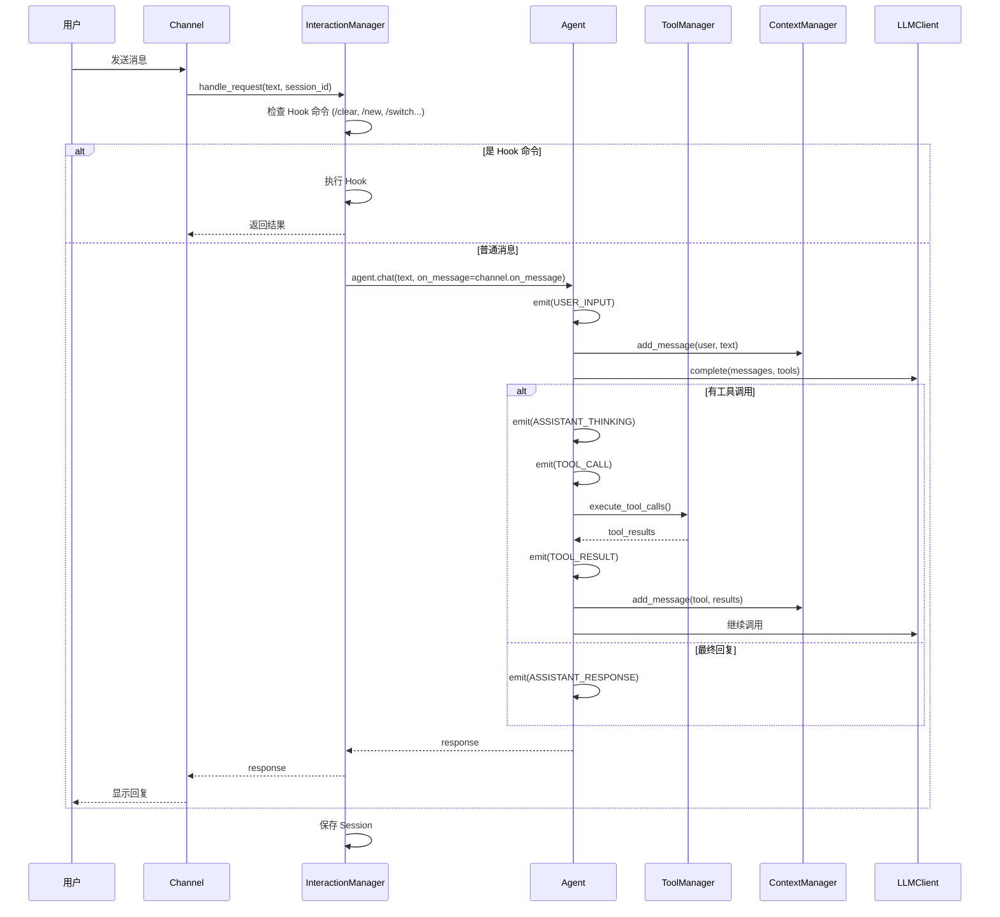
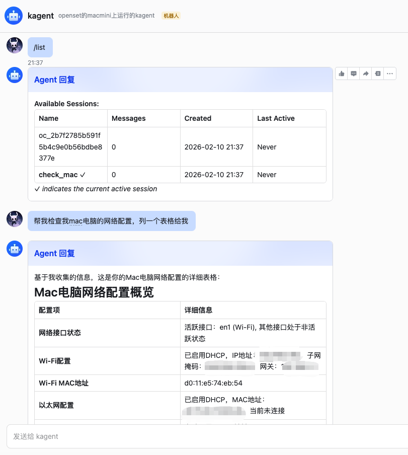

# kAgent 🤖

一个模块化、可扩展的 Python AI Agent 框架，支持多渠道接入、多会话管理和强大的工具调用系统。

[](https://www.python.org/downloads/)
[](https://opensource.org/licenses/MIT)

---

## 📋 目录

- [特性](#-特性)
- [架构设计](#-架构设计)
- [快速开始](#-快速开始)
- [配置说明](#-配置说明)
- [使用指南](#-使用指南)
- [扩展开发](#-扩展开发)
- [项目结构](#-项目结构)

---

## ✨ 特性

- **🔄 多渠道支持** - 支持 Shell、飞书、TUI、语音等多种交互通道
- **💬 多会话管理** - 独立会话状态，支持切换、保存和恢复
- **🛠️ 工具调用系统** - 内置文件操作、代码执行、搜索等工具，支持 MCP 协议
- **🧩 Skill 系统** - 模块化技能加载，支持自定义扩展
- **🤖 多模型支持** - 兼容 OpenAI、Claude 等主流 LLM 提供商
- **⚡ 异步架构** - 基于 asyncio 的高性能并发处理

---

## 🏗️ 架构设计

### 核心架构

```
┌─────────────────────────────────────────────────────────────┐
│                        AgentApp                              │
│                     (应用入口)                               │
└─────────────────────────────────────────────────────────────┘
                              │
          ┌───────────────────┴───────────────────┐
          ▼                                       ▼
┌─────────────────────┐               ┌─────────────────────┐
│      Channel        │               │ InteractionManager  │
│   (通信通道层)       │               │    (交互管理层)      │
│                     │               │                     │
│  - LarkChannel      │               │  - Session 管理     │
│  - ShellChannel     │               │  - Hook 命令拦截    │
│  - TUIChannel       │               │  - 消息事件分发     │
│  - AudioChannel     │               │                     │
└─────────────────────┘               └──────────┬──────────┘
          │                                      │
          │ on_message(event)                    │
          │ ◄────────────────────────────────────┘
          ▼
┌─────────────────────┐               ┌─────────────────────┐
│   MessageEvent      │               │       Agent         │
│   (消息事件系统)     │               │    (对话循环核心)    │
│                     │               │                     │
│  - USER_INPUT       │               │  - 工具调用编排     │
│  - ASSISTANT_THINKING│              │  - 多轮对话管理     │
│  - TOOL_CALL        │               │  - 事件发送         │
│  - TOOL_RESULT      │               │                     │
│  - ASSISTANT_RESPONSE│              │                     │
└─────────────────────┘               └──────────┬──────────┘
                                                 │
          ┌─────────────────────────────────────┼─────────────────────┐
          ▼                                     ▼                     ▼
┌──────────────────┐              ┌──────────────────┐     ┌──────────────────┐
│   ToolManager    │              │  ContextManager  │     │    LLMClient     │
│   (工具管理器)    │              │   (上下文管理)    │     │   (LLM 客户端)   │
│                  │              │                   │     │                  │
│  - 工具注册      │              │  - 消息历史      │     │  - OpenAI        │
│  - 工具执行      │              │  - Token 压缩    │     │  - Claude        │
│  - MCP 适配器    │              │  - Skill 管理    │     │  - 自定义 Provider│
└──────────────────┘              └────────┬─────────┘     └──────────────────┘
                                            │
                                            ▼
                                   ┌──────────────────┐
                                   │   AgentRuntime   │
                                   │    (运行时数据)   │
                                   │                   │
                                   │  - session_id    │
                                   │  - conversation  │
                                   │  - loaded_skills │
                                   │  - config        │
                                   └──────────────────┘
```

### 消息事件系统

消息事件系统提供统一的消息回调机制，支持多种消息类型的处理：

```
┌─────────────────────────────────────────────────────────────────┐
│                        Agent.chat()                              │
│  ┌─────────────────────────────────────────────────────────┐    │
│  │  emit(MessageEvent.user_input(...))                     │    │
│  │  emit(MessageEvent.assistant_thinking(...))             │    │
│  │  emit(MessageEvent.tool_call(...))                      │    │
│  │  emit(MessageEvent.tool_result(...))                    │    │
│  │  emit(MessageEvent.assistant_response(...))             │    │
│  └─────────────────────────────────────────────────────────┘    │
│                              │                                   │
│                              ▼                                   │
│                    on_message(event)                             │
└─────────────────────────────────────────────────────────────────┘
                               │
                               ▼
┌─────────────────────────────────────────────────────────────────┐
│                      BaseChannel                                 │
│  ┌─────────────────────────────────────────────────────────┐    │
│  │  on_message(event):                                      │    │
│  │    if USER_INPUT:      _display_user_input()            │    │
│  │    if THINKING:        _display_thinking()              │    │
│  │    if TOOL_CALL:       _display_tool_call() ← show控制  │    │
│  │    if TOOL_RESULT:     _display_tool_result() ← show控制│    │
│  │    if RESPONSE:        _display_response()              │    │
│  │    if ERROR:           _display_error()                 │    │
│  └─────────────────────────────────────────────────────────┘    │
└─────────────────────────────────────────────────────────────────┘
```

**事件类型**:

| 事件类型 | 说明 | 显示控制 |
|---------|------|---------|
| `USER_INPUT` | 用户输入 | 始终显示 |
| `ASSISTANT_THINKING` | 助手思考内容 | 始终显示 |
| `TOOL_CALL` | 工具调用 | `show_tool_calls` 控制 |
| `TOOL_RESULT` | 工具结果 | `show_tool_calls` 控制 |
| `ASSISTANT_RESPONSE` | 最终回复 | 始终显示 |
| `ERROR` | 错误信息 | 始终显示 |

### 数据流



---

## 🚀 快速开始

### 1. 克隆项目

```bash
git clone <repository-url>
cd kagent
```

### 2. 安装依赖

```bash
pip install openai httpx python-dotenv lark-oapi textual tiktoken anthropic
```

### 3. 配置环境变量

复制 `.env.example` 为 `.env` 并填写配置：

```bash
cp .env.example .env
```

编辑 `.env` 文件：

```env
# LLM 配置 (OpenAI)
LLM_PROVIDER=openai
OPENAI_API_KEY=your_api_key_here
OPENAI_BASE_URL=https://api.openai.com/v1
OPENAI_MODEL=gpt-4o

# 或 Claude 配置
# LLM_PROVIDER=anthropic
# ANTHROPIC_API_KEY=your_api_key_here
# ANTHROPIC_MODEL=claude-4.5

# 飞书配置 (可选，用于飞书机器人)
APP_ID=cli_xxx
APP_SECRET=xxx
```

### 4. 运行 Shell 模式

```bash
python test/shell_app.py
```

### 5. 运行飞书机器人

```bash
python test/lark_app.py
```

---

## ⚙️ 配置说明

### 环境变量

| 变量名 | 说明 | 必填 |
|--------|------|------|
| `LLM_PROVIDER` | 模型提供商 (`openai` / `anthropic`) | ✅ |
| `OPENAI_API_KEY` | OpenAI API 密钥 | 条件 |
| `OPENAI_BASE_URL` | OpenAI API 基础 URL | ❌ |
| `OPENAI_MODEL` | OpenAI 模型名称 | ❌ |
| `ANTHROPIC_API_KEY` | Claude API 密钥 | 条件 |
| `ANTHROPIC_MODEL` | Claude 模型名称 | ❌ |
| `APP_ID` | 飞书应用 ID | 飞书通道 |
| `APP_SECRET` | 飞书应用密钥 | 飞书通道 |

### Agent 配置

Agent 配置可通过 Markdown 文件定义，示例：

```markdown
# Agent: MyAssistant

## Type
main

## Tools
all

## Skills
- code-review
- git-helper

## Description
一个智能编程助手

## Prompt
你是一个专业的编程助手，擅长 Python 开发...
```

---

## 📖 使用指南

### Shell 命令

| 命令 | 说明 |
|------|------|
| `/help` | 显示帮助信息 |
| `/new [name]` | 创建新会话 |
| `/switch <name>` | 切换到指定会话 |
| `/list` | 列出所有会话 |
| `/delete <name>` | 删除会话 |
| `/rename <old> <new>` | 重命名会话 |
| `/clear` | 清除当前会话历史 |
| `/compress` | 压缩上下文 |
| `/save` | 保存会话到磁盘 |
| `/history` | 显示会话历史 |
| `/tools` | 列出可用工具 |
| `exit`, `quit` | 退出 Shell |

### 内置工具

| 工具 | 描述 |
|------|------|
| `bash` | 执行 shell 命令 |
| `read_file` | 读取文件内容 |
| `write_file` | 写入文件内容 |
| `edit_file` | 编辑文件内容 |
| `grep` | 搜索文件内容 |
| `glob` | 文件模式匹配 |

---

## 🔧 扩展开发

### 自定义工具

在 `kagent/tools/` 目录创建新文件：

```python
from kagent.core.tool import tool

@tool(param_descriptions={
    "city": "城市名称"
})
async def get_weather(city: str) -> str:
    """获取城市天气信息"""
    # 实现逻辑
    return f"{city} 天气晴朗"
```

### 自定义 Channel

```python
from kagent.channel.base import BaseChannel
from kagent.core.events import MessageEvent

class MyChannel(BaseChannel):
    def __init__(self, show_tool_calls: bool = True):
        super().__init__(show_tool_calls=show_tool_calls)
    
    async def _display_user_input(self, content: str):
        # 显示用户输入
        pass
    
    async def _display_thinking(self, content: str):
        # 显示助手思考内容
        pass
    
    async def _display_tool_call(self, tool_name: str, arguments: dict, tool_call_id: str = None):
        # 显示工具调用 (受 show_tool_calls 控制)
        pass
    
    async def _display_tool_result(self, tool_name: str, result: any, success: bool, error: str = None):
        # 显示工具结果 (受 show_tool_calls 控制)
        pass
    
    async def _display_response(self, content: str):
        # 显示最终回复
        pass
    
    async def _display_error(self, message: str, details: str = None):
        # 显示错误信息
        pass
    
    async def send_message(self, target_id: str, content: str, **kwargs):
        # 发送消息给用户
        pass
    
    def start(self):
        # 启动通道
        pass
```

**参数说明**:
- `show_tool_calls`: 控制是否显示工具调用和结果信息，默认 `True`
  - Shell/TUI 通道默认开启
  - 飞书通道默认关闭 (避免消息过多)

### 自定义 LLM Provider

```python
from kagent.llm.base import BaseLLMProvider

class MyProvider(BaseLLMProvider):
    async def complete(self, messages, tools=None, **kwargs):
        # 实现 LLM 调用逻辑
        pass
```

---

## 📁 项目结构

```
kagent/
├── app/                  # 应用入口
│   └── main_app.py       # AgentApp 协调 Channel 和 InteractionManager
│
├── channel/              # 通信通道层
│   ├── base.py          # BaseChannel 抽象基类
│   ├── lark.py          # 飞书机器人
│   ├── shell.py         # 终端交互
│   ├── tui.py           # Textual TUI
│   └── audio.py         # 语音交互
│
├── core/                 # 核心层
│   ├── agent.py         # Agent 对话循环
│   ├── config.py        # 配置管理
│   ├── context.py       # ContextManager + AgentRuntime
│   ├── events.py        # MessageEvent 消息事件系统
│   ├── skill.py         # Skill 系统
│   └── tool.py          # ToolManager + @tool 装饰器
│
├── interaction/         # 交互层
│   ├── hook.py          # HookDispatcher 命令拦截
│   └── manager.py       # InteractionManager 会话管理
│
├── llm/                 # LLM 提供商
│   ├── base.py          # BaseLLMProvider 抽象
│   ├── client.py        # LLMClient 统一入口
│   ├── openai_provider.py
│   └── claude_provider.py
│
└── tools/               # 工具实现
    ├── bash.py          # 执行命令
    ├── read.py          # 读取文件
    ├── write.py         # 写入文件
    ├── edit.py          # 编辑文件
    ├── grep.py          # 搜索内容
    └── glob.py          # 文件匹配
```

---

## 🤖 飞书示例

<div align="center">
  
  <br/><br/>
  
</div>

---

## 📝 核心理念

### 数据与操作分离

```
AgentRuntime (数据)           ContextManager (操作)
┌─────────────────┐          ┌─────────────────────┐
│ session_id      │          │ add_message()       │
│ conversation    │  ──────► │ get_messages()      │
│ loaded_skills   │          │ compress_context()  │
│ token_count     │          │ load_skill()        │
│ system_prompt   │          │ ...                 │
└─────────────────┘          └─────────────────────┘
```

- **AgentRuntime**: 纯数据类，存储会话状态
- **ContextManager**: 操作 runtime 中的数据
- **Session 切换**: 只需替换 runtime，ContextManager 保持不变

### Session 管理

每个 Session 完全独立：
- 独立的对话历史
- 独立的 loaded_skills
- 独立的 system_prompt

切换 Session 时只需更新 runtime：
```python
self.agent.context.update_runtime(new_runtime)
```

---

## 📄 许可证

本项目基于 [MIT License](LICENSE) 开源。

---

<div align="center">
  <sub>Built with ❤️ using Python</sub>
</div>
