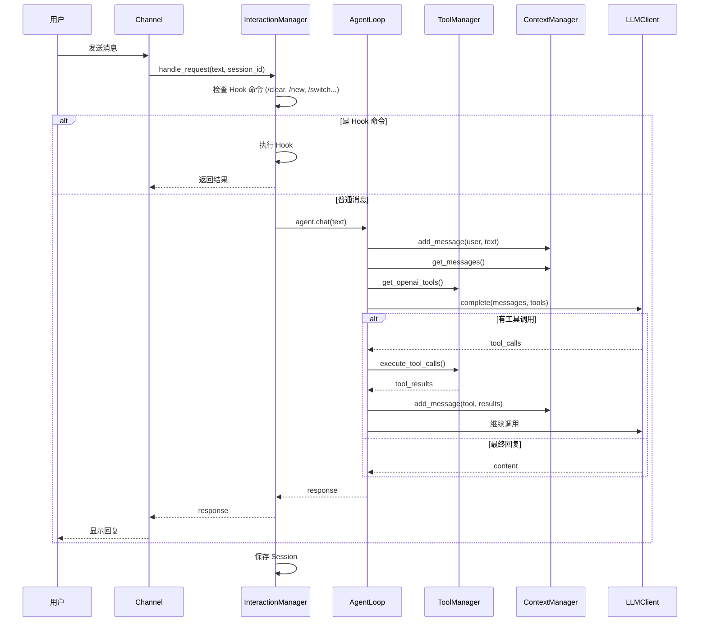

# kAgent

一个基于 Python 的 AI 编程助手，支持多渠道接入、多会话管理、强大的工具调用系统。

## 🏗️ 架构设计

### 核心概念

```
┌─────────────────────────────────────────────────────────────┐
│                        AgentApp                              │
│                     (应用入口)                               │
└─────────────────────────────────────────────────────────────┘
                              │
          ┌───────────────────┴───────────────────┐
          ▼                                       ▼
┌─────────────────────┐               ┌─────────────────────┐
│      Channel       │               │ InteractionManager  │
│   (通信通道层)      │               │    (交互管理层)      │
│                    │               │                     │
│  - LarkChannel    │               │  - Session 管理     │
│  - ShellChannel   │               │  - Hook 命令拦截    │
│  - TUIChannel     │               │  - 委托给 AgentLoop │
│  - AudioChannel   │               │                     │
└─────────────────────┘               └──────────┬──────────┘
                                                │
                                                ▼
                                     ┌─────────────────────┐
                                     │     AgentLoop       │
                                     │    (对话循环核心)   │
                                     │                     │
                                     │  - 工具调用编排     │
                                     │  - 多轮对话管理     │
                                     └──────────┬──────────┘
                                                │
          ┌─────────────────────────────────────┼─────────────────────┐
          ▼                                     ▼                     ▼
┌──────────────────┐              ┌──────────────────┐     ┌──────────────────┐
│   ToolManager    │              │  ContextManager  │     │    LLMClient     │
│   (工具管理器)   │              │   (上下文管理)    │     │   (LLM 客户端)   │
│                  │              │                   │     │                  │
│  - 工具注册     │              │  - 消息历史      │     │  - OpenAI        │
│  - 工具执行     │              │  - Token 压缩    │     │  - Claude        │
│  - MCP 适配器   │              │  - Skill 管理    │     │  - 自定义 Provider│
└──────────────────┘              └────────┬─────────┘     └──────────────────┘
                                            │
                                            ▼
                                   ┌──────────────────┐
                                   │   AgentRuntime   │
                                   │    (运行时数据)   │
                                   │                   │
                                   │  - session_id    │
                                   │  - conversation  │
                                   │  - loaded_skills │
                                   │  - config        │
                                   └──────────────────┘
```

### 数据流



### 目录结构

```
kagent/
├── app/                  # 应用入口
│   └── main_app.py       # AgentApp 协调 Channel 和 InteractionManager
│
├── channel/              # 通信通道层
│   ├── base.py          # BaseChannel 抽象基类
│   ├── lark.py          # 飞书机器人
│   ├── shell.py         # 终端交互
│   ├── tui.py           # Textual TUI
│   └── audio.py         # 语音交互
│
├── core/                 # 核心层
│   ├── agent.py         # AgentLoop 对话循环
│   ├── config.py        # 配置管理
│   ├── context.py       # ContextManager + AgentRuntime
│   ├── skill.py         # Skill 系统
│   └── tool.py          # ToolManager + @tool 装饰器
│
├── interaction/         # 交互层
│   ├── hook.py          # HookDispatcher 命令拦截
│   └── manager.py       # InteractionManager 会话管理
│
├── llm/                 # LLM 提供商
│   ├── base.py          # BaseLLMProvider 抽象
│   ├── client.py        # LLMClient 统一入口
│   ├── openai_provider.py
│   └── claude_provider.py
│
└── tools/               # 工具实现
    ├── bash.py          # 执行命令
    ├── read.py          # 读取文件
    ├── write.py         # 写入文件
    ├── edit.py          # 编辑文件
    ├── grep.py          # 搜索内容
    └── glob.py          # 文件匹配
```

## 🎯 核心理念

### 数据与操作分离

```
AgentRuntime (数据)           ContextManager (操作)
┌─────────────────┐          ┌─────────────────────┐
│ session_id      │          │ add_message()       │
│ conversation    │  ──────► │ get_messages()      │
│ loaded_skills   │          │ compress_context() │
│ token_count     │          │ load_skill()        │
│ system_prompt   │          │ ...                 │
└─────────────────┘          └─────────────────────┘
```

- **AgentRuntime**: 纯数据类，存储会话状态
- **ContextManager**: 操作 runtime 中的数据
- **Session 切换**: 只需替换 runtime，ContextManager 保持不变

### Session 管理

每个 Session 完全独立：
- 独立的对话历史
- 独立的 loaded_skills
- 独立的 system_prompt

切换 Session 时：
```python
# 只需更新 runtime，ContextManager 不变
self.agent.context.update_runtime(new_runtime)
```

## 🚀 快速开始

### 1. 安装依赖

```bash
pip install openai httpx python-dotenv lark-oapi textual tiktoken anthropic
```

### 2. 配置环境变量

创建 `.env` 文件：

```env
# LLM 配置
LLM_API_KEY=your_api_key
LLM_MODEL=gpt-4o

# 飞书配置 (可选)
APP_ID=cli_xxx
APP_SECRET=xxx
```

### 3. 运行 Shell 测试

```bash
python test/shell_app.py
```

### 4. 运行飞书机器人

```bash
python test/lark_app.py
```

## 🔧 扩展开发

### 自定义工具

在 `kagent/tools/` 目录创建新文件：

```python
from kagent.core.tool import tool

@tool(param_descriptions={
    "city": "城市名称"
})
async def get_weather(city: str) -> str:
    """获取城市天气"""
    return f"{city} 天气晴朗"
```

### 自定义 Channel

```python
from kagent.channel.base import BaseChannel

class MyChannel(BaseChannel):
    async def send_message(self, target_id: str, content: str, **kwargs):
        # 实现消息发送
        pass
    
    def start(self):
        # 启动通道
        pass
```

### 自定义 LLM Provider

```python
from kagent.llm.base import BaseLLMProvider

class MyProvider(BaseLLMProvider):
    async def complete(self, messages, tools=None, ...):
        # 实现 LLM 调用
        pass
```

## 📁 Session 管理

内置 Hook 命令：

| 命令 | 说明 |
|------|------|
| `/clear` | 清除当前会话历史 |
| `/compress` | 压缩上下文 |
| `/new [name]` | 创建新会话 |
| `/switch <name>` | 切换到指定会话 |
| `/list` | 列出所有会话 |
| `/delete <name>` | 删除会话 |
| `/rename <name>` | 重命名当前会话 |
| `/history` | 查看历史记录 |
| `/tools` | 列出可用工具 |

## 🤖 飞书示例


